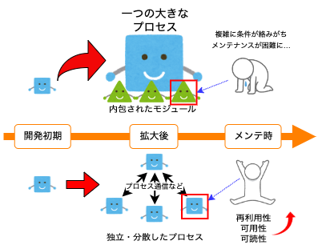
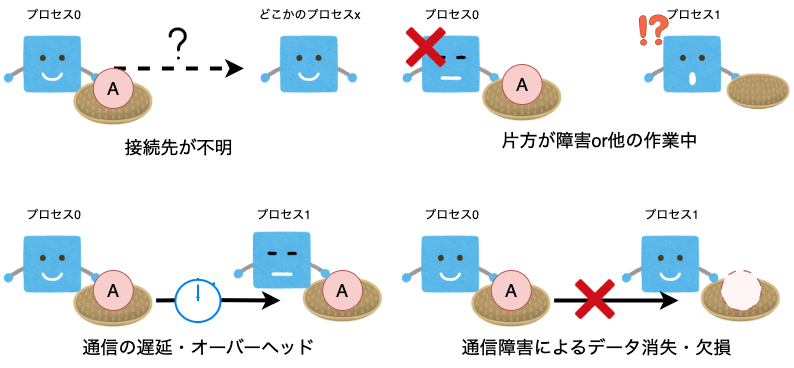
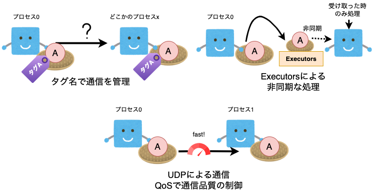

# ROSトピック

ここでは、ROSを理解する上で最も根幹となる「ROSトピック」(ros-topic)について理解することを目的とします。

ROSトピックは一つのプロセスから別の複数のプロセスに対してデータを転送することができるシステムです。送受信に必要なものはメッセージのタグのみで、通信相手のアドレスは不要です。これはPub-Sub通信（配信・購読型通信）と呼ばれます。

次からは、事前知識としてPub-Sub通信を行う上で知っておきたい「直交性」について説明します。

 

## 直交性

ここでは、Pub-Sub通信を理解する上で押さえておきたい「直交性」について簡単に説明します。

 

マイコンでは、一つのターゲットに対して一つのバイナリを生成して書き込むことが多いと思います。機能ごとにライブラリやモジュールとしてファイルを分割するとしても最終的に1つのmainファイルにリンクされるようになります。

小規模であれば全く問題ないものの、大規模になるにつれてモジュールとともにmainプログラムが肥大化していきます。こうなると非常にメンテナンスが大変になります。

すごく綺麗にコーディングされている場合を除いて、内包されたモジュールが他の変数を見ている可能性が（構造上）ありますし、使用しているライブラリの統一のために新しいモジュールを作ったり諦めたりする必要があるかもしれません。

また、特定のプロセスに対して機能を詰めすぎると可読性や可用性が下がります。後輩に引き継ぐ時などに技術的負債（コード資産に隠れたコスト）を負うかもしれません。

そのため、マイコン分野でも制御用途ごとに専用の制御用回路を作成して再利用可能なモジュールを作成することがあると思います。

 

マイコンにおける用途ごとのモジュール分割のように、コンピュータ内でも同一アプリケーションで立ち上げるプログラムを分散化させて管理する方法はしばしばとられています。

このようなプログラムはプログラム単位ごとに「ノード（Node）」と呼ばれます。

ノードは基本的に一つの機能を一つのプロセスとして動かすことを目的としていて、ターゲットが増減するアプリケーション・ゲームではよく使われます。

ノードは単体で動作することがほとんどなので、原因の追跡やノード自体の取り替えを容易に行うことができます。

ノードに分けることで、再利用性や可用性・可読性の向上などの様々なメリットがあります。

 

ノードのようにターゲットの発生・消失が他のアプリケーションに直接的な影響を与えない場合、これを「直交」と呼びます。

直交とは、あるい変数などが変化した時、この変更が他の変数に対して影響を与えていない状態を指します。これは、プログラミングの世界でもよく使われる表現で、より良いプログラムを書くためのテクニックとされています。

 

### プロセス間通信における困難

先ほどまでの説明で、Pub-Subに使う直交性という概念を説明しました。ROSのコーディングは、メッセージの種類と転送方法以外はあまり通信先の状況を気にせずにかけるような設計がされています。

しかしながら、プロセス同士（あるいはデバイス同士）の通信はいくつか困難があります。

その例を4つ挙げます。

- 接続先が不明（指定しても、存在しないかもしれない）
- 片方が障害or作業中（同期処理だとうまく動かなくなる）
- 通信の遅延・オーバーヘッド
- 通信障害によるデータ消失・欠損

こちらは、ソフトウェア開発にとどまらずあらゆるメッセージのやり取りにおいて衝突する問題だと思います。

 

ROSでは、これらの問題を次のように解決しています。

- 通信をタグ名で管理
- Executorsによる非同期な処理
- UDPによる通信とQoSによる通信品質の制御

通信をタグ名で管理とはまさにPub-Sub通信の根幹となる部分で、送信先をタグ名で決定することで必要な情報を適切に通すことができます。例えば、欲しい情報があったときに、そのチャンネルをお気に入り登録して常に見れるようにするシステムがあれば、そのチャンネルが発信者（Publisher）で見る人が受信者（Subscriber）となります。

また、ROSはメッセージの送受信を行うモジュールを非同期で実行できるようにしており、受信が発生したら特定の関数を呼び出すことができます。

この処理方法により、割り込み処理のような感覚でデータの受信部分を書くことができます。

通信の速度や品質というのはトレードオフの関係となっており、通信速度が速くオーバヘッドが小さいシステムだと、データ欠損した場合の検知ができなくなってしまいますが、そこを冗長にすると、今度はロボットに必要なリアルタイム性を大きく損ねてしまう可能性があります。

そこで、ROS2は通信のオーバーヘッドが小さいUDPを採用しながら通信品質も制御できるQoS（Quality of Service）を採用したDDS（Data Distribution Service）を通信基盤として用いています。

 

## ROSトピック

ここからROSトピックについて説明します。

ROSノードは、任意の数のトピックにデータを公開し、同時に任意の数のトピックにサブスクリプションを持つことができます。

送信側と受信側のタグが一致している場合にデータの通信を開始します。

 

複数の送信先がある場合も問題なく転送できます。

 

ROSによるロボット開発では、これをツリー状に広げて行くことでシステムを開発していきます。

この通信では、一方方向の非同期通信のみを扱っていますが、同期通信も想定してServiceやActionなどもAPIを揃えています。

 
